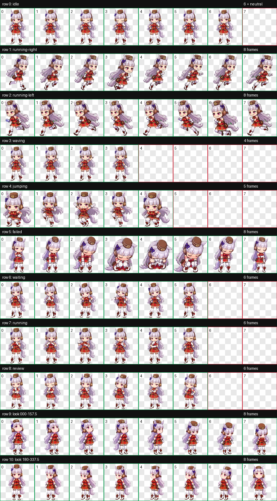
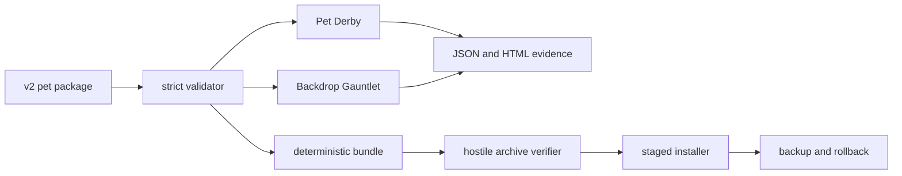

# Gold Ship Codex Pet

[](https://github.com/KanadeK/gold-ship-codex-pet/actions/workflows/ci.yml)
[](https://github.com/KanadeK/gold-ship-codex-pet/actions/workflows/security.yml)
[](https://kanadek.github.io/gold-ship-codex-pet/)
[](LICENSE)

An unofficial, non-commercial Gold Ship fan pet for Codex. The repository ships
a complete format-v2 animation atlas and two reusable QA tools for any v2 pet:

- **Pet Derby** replays a seeded mix of animation states and all 16 look
  directions, then checks coverage and adjacent-frame continuity.
- **Backdrop Gauntlet** measures every active cell at multiple scales against a
  configurable desktop palette, then emits deterministic JSON, PNG, and HTML
  evidence.



This is not an official Cygames project and is not affiliated with or endorsed
by Cygames. Read [ASSET_LICENSE.md](ASSET_LICENSE.md) before redistributing the
fan-art asset.

## Why Gold Ship

Gold Ship is a real character from *Umamusume: Pretty Derby*, with an official
character page, continuing official media presence, and broad international
recognition. A collision search on 2026-07-30 found no Gold Ship Codex pet in
the major Codex pet galleries, their manifests, GitHub repository search, or
the local project catalog. Absence from a search is not proof that no private
or unindexed implementation exists.

The complete selection evidence, rejected candidates, query vocabulary, and
rights boundary are recorded in [docs/research.md](docs/research.md).

## What is real here

This is not a theme-only repository:

- 1536 x 2288 lossless WebP v2 atlas with 73 animation cells, one dedicated
  neutral-look frame, and 14 transparent unused cells
- strict manifest, geometry, sparse-cell, unused-cell, chroma, edge, motion,
  and look-direction checks
- seeded 564-step example race with deterministic sequence hashing
- 73-cell multi-background audit at configured scales
- hostile archive checks for traversal, symlinks, duplicate names, size, and
  checksum tampering
- validate-before-write installer with lock, staging, backup, doctor, uninstall,
  and rollback paths
- deterministic `.codex-pet`, wheel, sdist, and SHA-256 release artifacts
- reusable composite GitHub Action
- 90% branch coverage release gate
- CI, CodeQL, GitHub Pages, tagged release automation, and Dependabot

## Quick start

Python 3.10 or newer is required.

```bash
python -m venv .venv
python -m pip install --upgrade pip
python -m pip install -e ".[dev]"
```

Validate the pet and run both audit engines:

```bash
golshi-pet validate pet --strict --json
golshi-pet derby pet \
  --plan examples/gold-ship-chaos-race.json \
  --strict \
  --json-out build/pet-derby/report.json \
  --html-out build/pet-derby/report.html
golshi-pet backdrop-audit pet \
  --backgrounds examples/backgrounds.json \
  --policy examples/backdrop-policy.json \
  --output-dir build/backdrop-audit \
  --json
```

Install from the verified Release bundle:

```bash
golshi-pet verify-bundle gold-ship.codex-pet --json
golshi-pet install gold-ship.codex-pet --dry-run --json
golshi-pet install gold-ship.codex-pet --json
golshi-pet doctor pet --json
```

By default, the installer targets `$CODEX_HOME/pets/gold-ship`, or
`~/.codex/pets/gold-ship` when `CODEX_HOME` is unset. Use `--codex-home` to
test in an isolated directory.

## Reuse Backdrop Gauntlet in another pet repository

```yaml
steps:
  - uses: actions/checkout@v7
  - uses: KanadeK/gold-ship-codex-pet@v0
    with:
      pet-path: pet
      output-dir: build/backdrop-audit
```

Custom palettes and policies can be passed through the `backgrounds` and
`policy` inputs. The defaults live inside this action, so callers do not need
to copy the example files.

## Architecture



The code is deliberately split by trust boundary. Atlas parsing never writes.
Archive verification extracts only after structural and checksum checks.
Installation writes only after strict validation and stages before swapping.
See [docs/architecture.md](docs/architecture.md).

<a id="acceptance"></a>

## Acceptance

The complete release gate is one command:

```bash
python scripts/release_check.py
```

It must finish with `"ok": true`. The gate runs:

```bash
python -m ruff check src tests scripts
python -m mypy src/golshi_pet scripts
python -m coverage run --branch -m pytest -q
python -m coverage report --fail-under=90
python scripts/secret_scan.py
python scripts/check_web.py web
python -m golshi_pet validate pet --strict --json
python scripts/build_release.py
python scripts/package_smoke.py
python scripts/build_site.py
python scripts/check_web.py site --require-assets
```

Release artifacts are accepted only if two independently built pet bundles are
byte-identical, every bundled member hash matches `SHA256SUMS`, and the
extracted pet passes strict validation.

<a id="repair"></a>

## Repair

Preserve the failing JSON and do not delete the installed pet or backups before
diagnosis.

| Failure | Inspect | Safe repair |
| --- | --- | --- |
| `manifest.*` or `atlas.*` | `golshi-pet validate pet --strict --json` | Restore the required field or atlas cell, then rerun strict validation. |
| `derby.*` | `build/pet-derby/report.html` | Repair the named adjacent frames, keep the seed, and rerun the same plan. |
| `backdrop.weak_edge` | `build/backdrop-audit/report.html` | Strengthen the named silhouette edge, then rerun the unchanged policy. |
| bundle checksum failure | Release `SHA256SUMS` | Download the bundle again. Never install a mismatched archive. |
| active install lock | the lock path in the error | Confirm no install process is running before removing only that lock file. |
| installed drift | `golshi-pet doctor pet --json` | Choose whether to keep the local edit or reinstall the verified source. |
| broken replacement | `golshi-pet rollback --pet-id gold-ship --dry-run --json` | Preview, then rerun without `--dry-run`. Current data is preserved as a backup. |
| newest backup invalid | rollback error JSON | Inspect older backups manually. The tool refuses to overwrite with invalid data. |

The longer recovery playbook is in [docs/repair.md](docs/repair.md).

## Development

```bash
python -m pip install -e ".[dev]"
python -m pytest -q
python -m ruff check src tests scripts
python -m mypy src/golshi_pet scripts
```

Example inputs:

- [examples/gold-ship-chaos-race.json](examples/gold-ship-chaos-race.json)
- [examples/backgrounds.json](examples/backgrounds.json)
- [examples/backdrop-policy.json](examples/backdrop-policy.json)

See [CONTRIBUTING.md](CONTRIBUTING.md) for test and asset contribution rules.

## License and provenance

The Python, JavaScript, CSS, workflow, test, and documentation code is MIT
licensed. Gold Ship, *Umamusume: Pretty Derby*, and related marks and character
rights belong to their respective owners. The fan-art atlas has a separate,
non-commercial rights notice in [ASSET_LICENSE.md](ASSET_LICENSE.md).

No official source image is committed. Generation inputs, asset hashes,
curation notes, and QA evidence are recorded in `artwork/qa/` and
`pet/provenance.json`. The published evidence includes the labeled 16-direction
sheet, three isolated blind classifications and their strict-majority result,
direction continuity metrics, a byte-preserving failed-loop repair, the
chroma-despill report, and strict v2 atlas validation.
